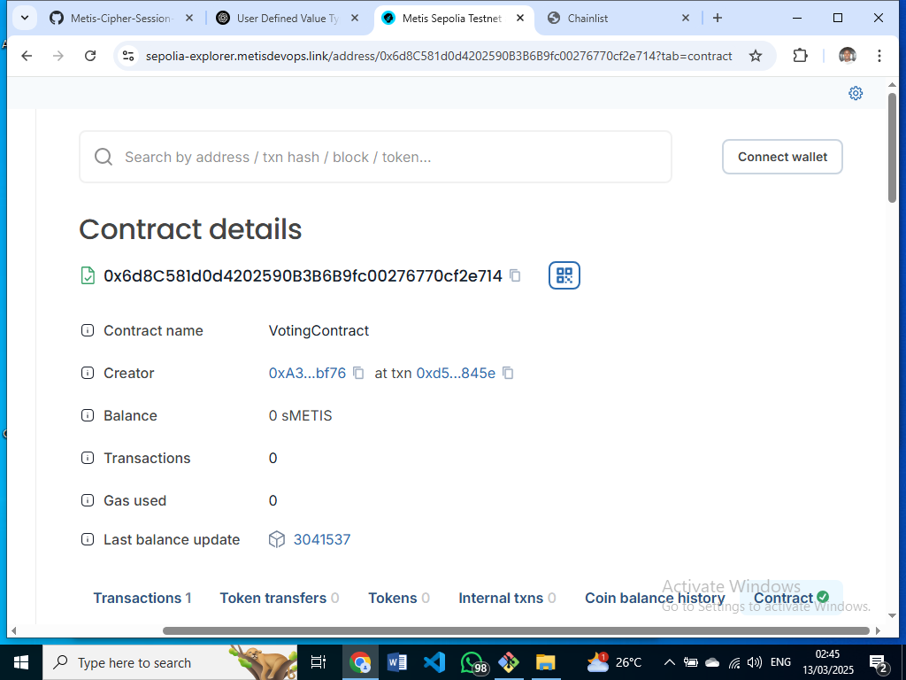

## Week 4 Assignment - SolomonDavid Akesobia

### Contract Address - 0x6d8C581d0d4202590B3B6B9fc00276770cf2e714

### Screenshot:

## Overflow vs Underflow

An **overflow** occurs when a number exceeds the maximum value of its data type.                 
An **underflow** occurs when a number's value is set to a value lower than it's minimum value (example, setting an unsigned integer to a value below 0).                                         